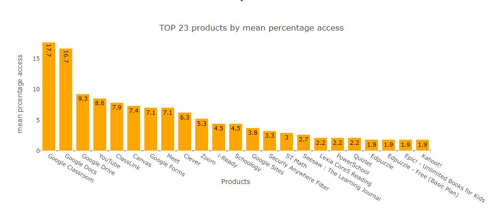

# COVID-19 Impact on Digital Learning (Sept.2021) 

# Problem Statement
The COVID-19 Pandemic has disrupted learning for more than 56 million students in the United States. In the Spring of 2020, most states and local governments across the U.S. closed educational institutions to stop the spread of the virus. In response, schools and teachers have attempted to reach students remotely through distance learning tools and digital platforms. Until today, concerns of the exacaberting digital divide and long-term learning loss among America’s most vulnerable learners continue to grow.

A. Data Preparation
Objectives of Data preparation:-

1. Cleaning provided datasets

2. Process the data (e.g., merging) and additional data sources accurately

3. Using the right methodologies for deleting rows

4. Increasing data integrity

5. Write an easy and reproducible code

Data preparation starts from importing data into the Kaggle notebook. Data sets used in this notebook are from Learn platform. Some additional data sets used here are state education rank and closing dates for state schools in the USA. Named these files as external datasets. How to join these data sets and What are the keys for connecting them, everything is shown in the Data joining diagram.

District info data file Preparation:- This dataset contains 233 rows 7 columns. Columns are ranges for each sub-category. In the cleaning process, brackets are removed and assigned variables that we can understand. This file also contains 57 NaN rows (57 schools hide by data provider). These rows are deleted from our dataset. Percentage of free/reduced, Percentage of black/Hispanic, Expenditure total, connection ratio columns contains missing values. As we know some of these variables do not apply to all states in the USA. So that if there is a missing value for a particular state then we fill these missings by zeros. This makes sense because some states are well developed, there is the possibility that these variables are not applicable. After processing this file contain 176 schools with all variable.

The distribution of districts(Schools) shows that Connecticut has 30 schools whereas North Dakota, Minnesota, etc has only one school. This may create a discrepancy in our analysis. So make a note that whenever I aggregate data at the state level it won't diverge my analysis.

Product info data file Preparation:- Only product URL variable is deleted from dataset.

Engagement file Preparation:-

It is a list of the percentage of access and engagement index for each product in schools. From the data set, we assume that if the percentage of access is zero then engagement is also zero. So that product with zero percentage of access is deleted in the engagement file. We use this approach because this data set is quite large. Deleting rows makes our processing bit a faster. In simple words, we are helping our machines to reduce processing time.

B. Data Exploration
Objectives Of Data exploration:-

Distribution of states and products in table format.
Number of record for each state by district.
Number of records for each product.
what are the TOP 20 products by pct_access ?
what are the TOP 20 products by engagement_index ?
How TOP 10 products engage with their audience in 2020 by state ?
Are engagement index and percentage access correlated?
How states engage with TOP 10 products in 2020 ?

B.1. Distribution of variables in the dataset
In the final data set, many records are unevenly distributed across all states. Connecticut has the highest number of records whereas North Dakota has a thousand records. This may increase data visualization discrepancy if we calculate mean values for states.
In the final data set, records for the TOP 20 products are evenly distributed. Google Docs has the highest number of records, which means this product is used mostly by students. Let's do analysis for TOP 20 products

B.2. What are the TOP 23 products by access/engagement index?
I choose TOP 23 products because last 4 product has same percentage access. It might be helpful in our analysis.

Google products are leaders of the education system in the United States. Surprisingly YouTube is in the top 5, this is the main product to do our analysis. Real-time meeting and video sharing products like Meet and Zoom are in the top 10 by the percentage of access. Clever digital learning platform for K12 schools is in 9th place.

B.3. What are the TOP 20 products by engagement_index?
Again Google Products are leaders by engagement index. As we can see most of the products are common as we have seen earlier. Surprisingly Instagram is at 14th place by engagement index. These two charts show that there is a possibility of correlation between the percentage of access and engagement index. Note:this fact was assumed during the data preparation stage. In data preparation, we removed products rows those has percentage access zero for each school. Let's validate this fact is true.

B.4. Are engagement index and percentage access correlated?
Correlation is calculated for random 10000 samples from the data set.
Note: Value of correlation changes if we re-run codes.

The engagement index and percentage of access are positively correlated. This plot also shows that our dataset has more records for low engagement index and low percentage of access. This chart also helps us to select one of the variables for our analysis. We are going to choose the engagement index in our analysis.

B.5. How do states engage with TOP 11 products in 2020?
TOP 10 products by engagement index are Google Docs, Google Classroom, YouTube, Instagram, Canvas, Schoology, Meet, Kahoot!, Google Forms, Google Drive, Seesaw: The Learning Journal. I am doing Statewise analysis for engagement index because the distribution of records for states has an outlier effect. Mean values will get affected by outliers. It is a safe approach to do state-wise analysis, as we know the top 20 products have no outlier effect. YouTube and Instagram also added for analysis. Mean is calculated for each product in each school in each state on a given week.

Insights:-

1) YouTube and Instagram don't have records for the first 20 weeks for all states. We can say that students and teachers were started to use these platforms for engagement.

2) Meet, Schoology, Seesaw: The Learning Journal -> These platforms have a unique engagement index in the dataset. Their engagement starts growing in the 10th week then goes down in holidays and again reaches to peaks up to 5K-10K engagements for all states.

3) Google Docs, Google Classroom, Google Drive, Google Forms are leaders by engagement index. We can see that engagement starts growing in the 10th week and engagements are higher than any other product. Also, we can see that engagements are less for weeks 34-45 compare to weeks 8-20. (reason: other products competing with google products)

4) Kahoot! and Canvas are completely losing engagement index throughout the year. Say COVID-19 hit these products most. These products are mostly used by schools and institutions. This is the main reason that in covid they are affected more than others.

Other useful insights:-

1) Arizona students don't use products like Instagram, Schoology, Meet, Seesaw: the learning journal, canvas.

2) Michigan state has a unique engagement index. The engagement index is increased for weeks 34-35. During the 10th-20th week, engagement was around 1K for all products but it reached up to 10K for weeks 34-45. The education system is improved in Michigan in COVID-19.

3) Minnesota state has records for 1st 17 weeks. We can not do covid-19 analysis for this state.

4) North Carolina state has improved education system in covid. After holidays engagements were higher than march covid engagement.

5) North Dakota State doesn't have engagement records after the 10th week. A complete collapse in education for this state. Also, we know that this state has only one district(school) in our dataset.

6) Tennessee state improved in engagement index.

7) Texas all products lose engagement from 34-45 weeks except Schoology. Surprisingly google docs and google classroom engagement index decreased by half during 34-45 weeks.

8) Washington state improved engagement index for education.

9) All other states except above are showing same kind of engagement index for all year.

C. What is the relation between the Engagement index and Black/Hispanic categories?
Outliers diverging our analysis. Let's do state wise analysis.

Let's do analysis for Black/Hispanic states (60-100% category)

These states are Arizona,California,Connecticut,District Of Columbia,Illinois, New York,Indiana,Texas,Virginia.
Insights from Black/Hispanic states:-

1) Arizona -> For weeks 10-20 engagement index was peak 1000 after the 30th-week engagement index reached up to 2000 for black/Hispanic students. Other categories are not available in this state.

2) California -> This state includes all category schools of black/Hispanic variable. If we compare charts for 80-100% and 0-20% category, 0-20% category school have engagement more than 80-100%. The overall increase in engagement for all schools in California state.(select category one by one you will see an increase for each category)

3) Connecticut -> This state doesn't have category 80-100%. But this state shows lower engagement as the black/Hispanic percentage increases.

4) Indiana -> if we compare 80-100% and 0-20% (select these two categories) we can see that during week 8-10 sudden drop in engagement for 80-100% category, there is drop for 0-20% category but slowly decreasing week by week. Surprisingly this state shows a higher engagement index for 80-100% category than 0-20% category.

5) New York -> Only state throughout the year 80-100% category has higher engagement than 0-20%.

D.1. What is the effect of covid-19 on free/reduced schools?
Outliers diverging our analysis. Let's do state wise analysis.

Let's do analysis for free/reduced schools(districts) (60-100% category)

These schools are 4550, 7164, 7975, 3248, 5042, 8784, 9043, 2870, 3222, 4808, 6144, 3550, 9536, 6584, 7767, 1791, 2130.
Insights:-

1) 2870 -> This school has only one category 60-80% free/reduced. Students who belong to this category lose engagement due to pandemics.

2) 3222 -> THis district starts losing engagement with the students at the start of the pandemic, then gains engagement for all weeks.

3) 3248 -> At the start of the pandemic this district gain more engagement then start decreasing over the year.

4) 3550 -> At the start of the pandemic this district lose engagement for the reduced/free category. After week 17 this district doesn't have any records. (state Minnesota )

5) 9536 -> At the start of the pandemic this district reach a higher engagement index(4K) then its stars slowly decreasing.

6) 7164,7767,7975,9043 districts show good engagement index.

D.2 What is the engagement index for Lower free/reduced Schools?
Conclusion :- Engagement index for lower free/reduced not that much affected in sept.-nov. period than march-may period. But schools with a higher free/reduced category schools affected more.

E.1. What are the trends of Engagement index with expenditure?
Insights:-

1) 4k-6k -> This category expenditure schools shows a decrease in engagement from sept-nov.

2) 22k-24k -> High expenditure schools showing less engagement index for sept-nov. It is Surprisingly not acceptable.

3) 10K -12K -> This category decrease engagement after the 40th week.

E.2. Calculate the percentage of increase or decrease in mean Engagement Index for expenditure categories
E.3. Why is engagement negative for expenditure 22k-24k category?
22k-24k expenditure categories school(7778) from New York state. This was happened due to COVID-19 cases were higher than in any other state. For period sept-nov this state was worst affected by COVID in the world.

F. How many products gain or lose engagement index throughout the pandemic COVID-19?
Products with increased Engagement Index
Products with decreased Engagement Index

